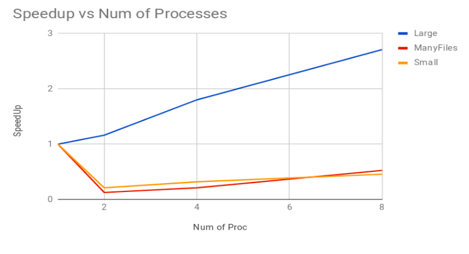

# Parallelized word-document index construction

## Aim

- Distributed construction of a word-document index using Message Passing on a Beowulf style cluster to achieve speedup and scalability.

## Assumptions

- A large collection of documents distributed in the secondary memories (i.e. hard disks) of multiple nodes in a cluster.
- The program was thoroughly tested and optimized for a distributed Beowulf style cluster which uses Message Passing for communication over Ethernet switches.
- All the Nodes/Cores in the cluster have identical configuration, Operating system and Architectures.
- In the context of this solution when we speak of the number of Processes, we assume each process runs on a different Node/Core in the cluster.
- Network file system (NFS) exists on the cluster such that processes on any node can access the secondary storage on any other node too.

## Design Requirements

- A global word-document index needs to be constructed to map every word to its documents and frequencies of occurrence across all the cluster nodes in the cluster. The construction of global index should be preceded by the construction of local indices, which can in turn be done using SPMD model of parallel programming. The local indices are merged into the global index over the network.
- A list structure to maintain the corresponding document and frequencies for the words ordered on the frequency of occurrence.
- A method for communicating local indices across processes to construct the global index.
- A method for merging the local indices into a large global index. Construction of global index has to be done using the MPMD model because only the root process has to do this work.

## Choice of Data Structures and other routines

- The local word index is a intermediate dictionary structure used for temporary storage of data required to construct the global index. The construction of such a local index is done serially in each process. Hence the traversal and add operations of such a structure should be efficient.
	- Hence *Trie* is chosen for the implementation of this dictionary.
- The global word-document index is a dictionary used to querying the documents with words. Hence the queries should be served efficiently.
	- The dictionary should return a sequence of frequency-document pairs for each query.
	- The *Trie* data structure is once again suitable to serve the above purpose.
- The list data structure has the following deliverables :
	- Merging of multiple such sequences/lists in order of the frequencies during the construction of the global index from local indices.
	- Dynamic growth (add operation) and shrinkage (delete) must be efficient.
	- Add operation add elements to the sequence/list in sorted order of decreasing frequency to maintain the ordering.
	- A *Linked List* is chosen keeping in mind the above requirement.
- MPI only supports communication of serial data, hence serialization of all the intermediate data structures (local index and lists) is a requirement for communication.

## Some thought provoking sub-problems

- The index receives queries in the form of words, hence a data structure like Trie which imposes a partial ordering based on the alphabets of the words inserted in it is a fit choice. Since a word can occur multiple times across multiple files, the best option is to hang/attach a list at the end nodes of words in the Trie. Each node if the list stores the frequency and document name.
- The traversal of Tries is extremely efficient in the average statistical estimate. But doing this operation for every word in the document will also invoke an `insert_in_order` operation in the lists hanging from the tries, which in turn would be inefficient because of the added overheads. Hence it is a better choice to maintain an intermediate structure which stores the frequencies of words for each document, and then merging this with the local index which invokes 1 `insert_in_order` routine for each unique word.
	- Such a scheme significantly reduces the additional overheads.
- Serialization of Tries, which are non-linear data structures, will require the generation of a unique code. The unique code that is generated in the serialization has to be used for re-construction of Tries in the root process. This generated code must be as compact as possible to ensure minimal communication overheads.
- Removal of stopwords will boost the performance of the implementation immensely without affecting the correctness of the system.

## Implementation Details

### Doc_Trie

- A Trie Data Structure to map words to their frequencies on the level of a single document i.e. a Doc_Trie is created for every document in the corpus. The neccessity for such an intermediate structure is explained in the section above.
- Apart from general insertion and lookup function of Tries, we also provide a custom Garbage collection routine that frees every Trie after using it. This works by employing a post order depth first traversal to free a Trie-node upon visiting it. This extra utility ensures minimal memory utilization, and hence helps demonstrate scalability of the solution.
- Such a scheme helps in maintaining low memory usage. It uses some extra computation but it scales well when it comes to data intensive tasks.

### Clus_Trie

- A Trie data structure is chosen for implementation of the Dictionary structure (Word-document index) as lookups in this structure will be very fast. Assuming a fairly large dataset, the Trie will be densely populated and hence the space used by Trie asymptotically will not grow as fast as the data grows. [The name Clus_Trie can be misleading, but all it means is the Trie at the level of a local node in the cluster].
- The same data structure is used to represent the local as well as the global level indices because no additional structural changes are need on the global index.
- At the `end Trie-nodes`, hangs a sequence/lists of frequency-documentName pairs sorted in decreasing order of frequency.

#### Asymptotic Analysis
- `Search` : Traverses the Trie for a given given word and returns the sequence list hanging at its End Trie-node.
	- Worst case cost : `O(a)` [`a` is the length of the longest word in the corpus].
- `Insert` : Traverses the Trie for a given word and calls `insert_in_order` on the sequence list hanging from its End Trie-nodes.
	- Cost of this routine is the worst case cost of lookup followed by the worst case cost of adding an Element to the sequence list.

### Seq_List

- The Seq_List is implemented as a Linked List keeping in mind the functionalities and scarce need of random accesses. The Seq_List stores a sequence of records sorted in order of their decreasing frequencies.

#### Asymptotic Analysis
- `Insert_in_order` : This routine is provided for keeping the Seq_List sorted after every Insertion.
	- Time Complexity : `O(n)` [Inserting one Element in a list of n Element]
- `Merge_list` : This routine takes as input two sorted Seq_Lists and returns a new merged sorted list.
	- Time Complexity : `O(max(a, b))` [`a` and `b` are sizes of original lists]

### Merger

- Upon completing the construction of a Doc_Trie for a document, we have a set of unique words in it corresponding to their frequencies. A simultaneous depth first traversal is used in  the process level Clus_Trie and Doc_Trie [creating Trie-nodes wherever required] and calling the `Insert_in_order` routine on the reaching the end nodes of Doc_Trie.
- A similar merger is specified for merging two Clus_Trie's calling `Merge_lists` instead of `Insert_in_order`.

### Serializer

- The major requirement for communicating any data structure using MPI is that the memory chunk should be allocated serially. Sending the Tries in a node-by-node fashion will increase the communication complexity tremendously. Hence sending the whole data structure in one go as a message is a reasonable choice. This posed a challenge for a non-linear data structure such as a Trie.
- A custom serializer was written for sending the whole data structure as a single message.
- This module can be divided into two major parts :
	- Serialize routines : These routines are provided for both the Tries and Linked Lists. These routines traverse the data structures and produce simple encodings which can be used for re-constructing the data structures on other nodes.
	- Deserialize routines : These routines parse the encoded messages to construct back the data structures into the memory.
- We have used optimized operations on raw bytes wherever possible for fast functionalities.

## Results

- Time is given in seconds

| Number of Processes / Dataset | A | B | C |
|:---:|:---:|:---:|:---:|
| 1 | 172.53 | 164.8 | 7.417 |
| 2 | 148.57 | 1304.99 | 35.25 |
| 3 | 95.80 | 783.75 | 23.21 |
| 4 | 63.69 | 313.8 | 16.25 |





### Dataset descriptions

- A : size - 1.5 GB; number of files : 16;
- B : size - 51.8 MB; number of files : 62152;
- C : size - 12.6 MB; number of files : 15389;

### Analysis

- Results reveal that in Large Datasets with fewer files our design scales very effectively, due to reduced communication overheads. However with smaller datasets with a large number of files our design faces severe communication bottlenecks. This bottleneck will persist as long as  index construction overhead is lesser than the communication.
- It can also be clearly seen that there is an increase in overhead of communication as one goes from one process to multiple processes. Although the speedup scaled as the number of processes increase since processing now takes more time than communication. As our design scales well for 2-8 processes, it demonstrates its robustness in terms of large datasets.

## Compiling and Running

- For compiling the code
	- `make compileAll`
- For running the program on `num` processes
	- `make run n=num`
- Example
```bash
	$ make compile
	$ make run n=4
```

- Make sure to change the path name of the datasets depending upon your machine's storage