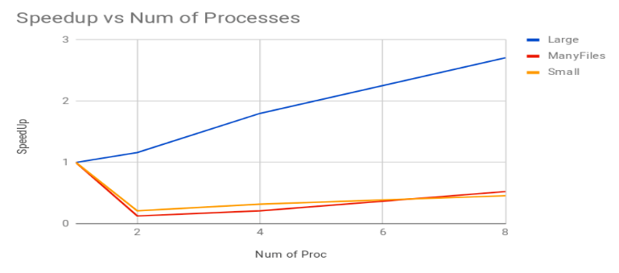

# Query Processing In Distributed Word-document Index

## Aim

- Comparing the performance of distributed word-document index in terms of queries with and without Bloom Filters.

## Assumptions

- A large collection of documents distributed in the secondary memories (i.e. hard disks) of multiple nodes in a cluster.
- The program was thoroughly tested and optimized for a distributed Beowulf style cluster which uses Message Passing for communication over Ethernet switches.
- All the Nodes/Cores in the cluster have identical configuration, Operating system and Architectures.
- In the context of this solution when we speak of the number of Processes, we assume each process runs on a different Node/Core in the cluster.
- Network file system (NFS) exists on the cluster such that processes on any node can access the secondary storage on any other node too.
- Bloom Filters of each Node is available with every other node.
- Most of the data structures used in Centralized method have been used in this method as well.

## Design Requirements

- Maintaining a distributed word-document index instead of a single Global index.
- Designing a scheme for Query Processing in a distributed environment.
- Comparing the performance of the distributed index with an addition of appropriate Bloom Filters on every Cluster Node.

## Bloom Filter

- Bloom Filter Implementation Details:
	- Implemented as bit vector model using unsigned int as C primitive data-type.
	- Size of Filter: 262144 
	- Number of Hash Functions : 8
	- Hash Type : Murmur-Hash
- The above specifications were chosen to minimise bloom filter false positive rate. Murmur Hash was chosen due to it’s high performance in text data in literature.

## Choice of schemes for Query Processing

- Master Slave :
	- The first and the very obvious choice for the query processing architecture. This model is simplistic and easy to maintain. The master Node sends its queries to all other Nodes and waits till the slaves respond. It then collects all the responses, accumulates them in order desired and displays the result. Although this assumption defeats the purpose of having a distributed query processing engine and this scheme is not scalable as well.
- Peer to peer :
	- Such a model may cause deadlocks if blocking calls are used and non-blocking calls will lead to busy waiting of Nodes. The other possible solutions involve multiple threads, some for querying and one for listening.
- Round robin master slave :
	- This scheme as it is simple yet efficient. Our scheme assumes that the master status keeps circulating across all nodes in fixed time slices [Time slices in our context refer to a fixed number of queries that the master can send to the slaves]. This approach highlights the fact that any node can receive any query in any order, and yet it’ll be processed and response will be sent back to the Node which requests it.

### Implementation of Query Processing scheme

- A circular List is maintained at each node wherein each element of the list corresponds to the flag status of each node. If the flag is set, then that particular node still has some pending queries. If the queries of a Node finish, that Node sends a special character to every other node, receiving which the flag corresponding to the original Node is reset.
- An iterator is maintained along with the list which demarcates the current master Node. Whenever a new master is to be chosen, the iterator traverses the circular list to find the next set flag and that Node is made the master. This reduces the unnecessary communication between Nodes to check if a particular Node has more queries.
- The Query Processing terminates when all the flags are reset.

## Index Construction

- The local indices are constructed in the same way it was done in the centralized model on the level of local nodes. But here, a global index is not constructed, instead queries arrive on any one of the nodes and it fetches relevant documents from indexes in every node. The other nodes send responses back to the requesting node, which collects the responses together and displays the result.

## Use of Bloom Filters

- Each process carries a copy of a Bloom Filter of local indexes in each of the other nodes. They query the bloom filter first and depending on the result, other nodes are queried. If the Bloom Filter returns True (may be a false positive) all the corresponding nodes are queried, otherwise not. This saves a lot extra communication as compared to the naive approach where all nodes are queried no matter what.

## Results

- Time is given in seconds

| Number of Processes | Without Bloom Filter | With Bloom Filter |
|:---:|:---:|:---:|
| 1 | 7.449 | 7.774 |
| 2 | 4.350 | 3.150 |
| 4 | 3.345 | 1.140 |
| 8 | 1.680 | 0.987 |




### Analysis

- The speedup plot is a clear demonstration of scalability of the solution which uses Bloom Filters.

## Compiling and Running

- For compiling the code
	- `make compileAll`
- For running the program on `num` processes
	- `make run n=num`
- Example
```bash
	$ make compile
	$ make run n=4
```

- `bloom_driver.c` is the driver file which uses the Bloom Filter whereas `driver.c` is without it. One can use this to compare the performance difference between the two systems.
- Make sure to change the path name of the datasets depending upon your machine's storage
